# 黄老吉记账 · 页面截图

> 截图时间：2026-09-30 · 数据环境：本地 MySQL（`hlj_ledger` 库），登录账号 `huanglaoji`（管理员）
> 桌面端视口 1440×900，移动端 390×844。截图均为 PNG，位于 `docs/screenshots/` 目录。

## 1. 登录页

登录 / 注册 / 找回密码三合一入口。注册需邮箱验证码，找回密码走邮箱验证码两步流程。

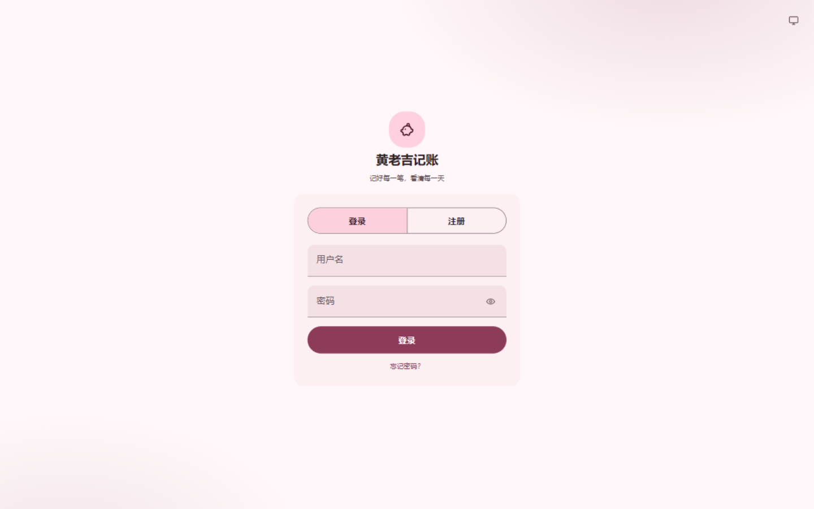

## 2. 总览（Dashboard）

本月结余、收入/支出/储蓄率/笔数统计卡，以及最近 6 个月收支趋势图。左侧为导航侧边栏（管理员可见"管理后台"入口）。

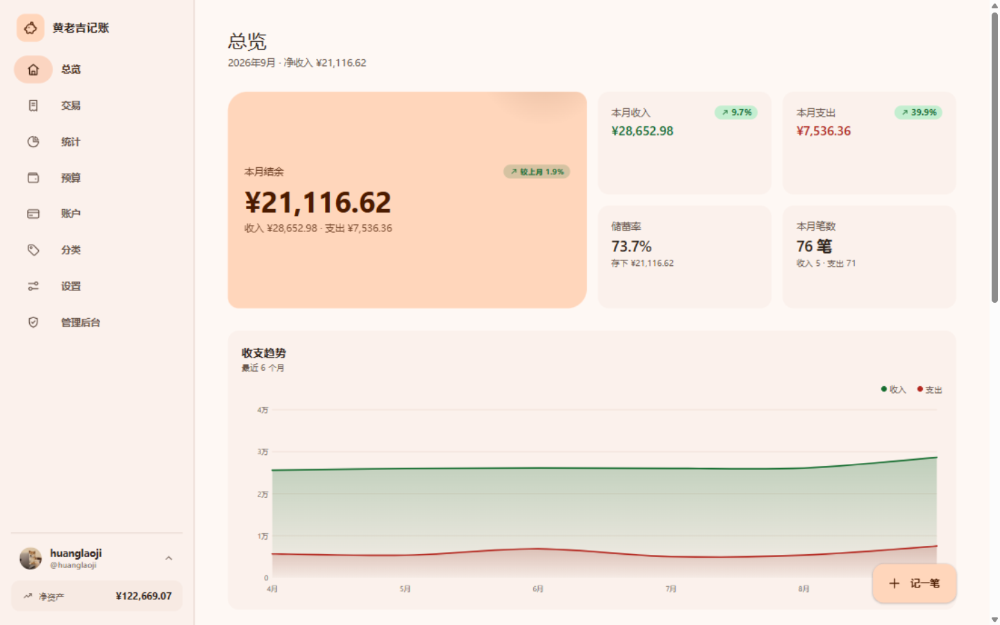

## 3. 交易明细

全部交易流水：支持关键词搜索、收入/支出筛选、按月份与账户过滤、分类标签筛选，右上角可导出 CSV。

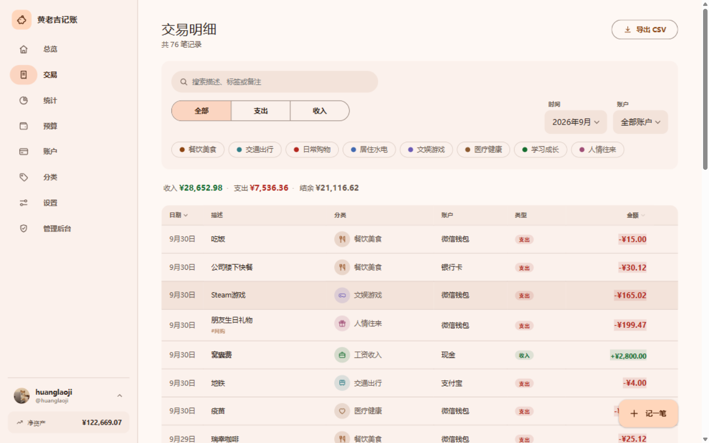

## 4. 统计分析

按月份切换的统计视图：月度收支对比柱状图、支出构成（分类环形图 + 排行）、收入来源分布等。

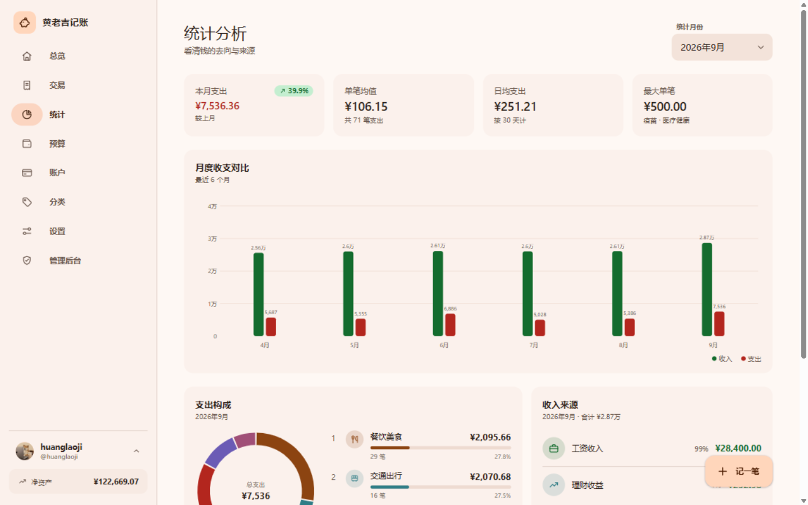

## 5. 预算管理

按分类设置月度预算，展示总执行进度与各分类的用量（正常 / 接近上限 / 超支三态）。

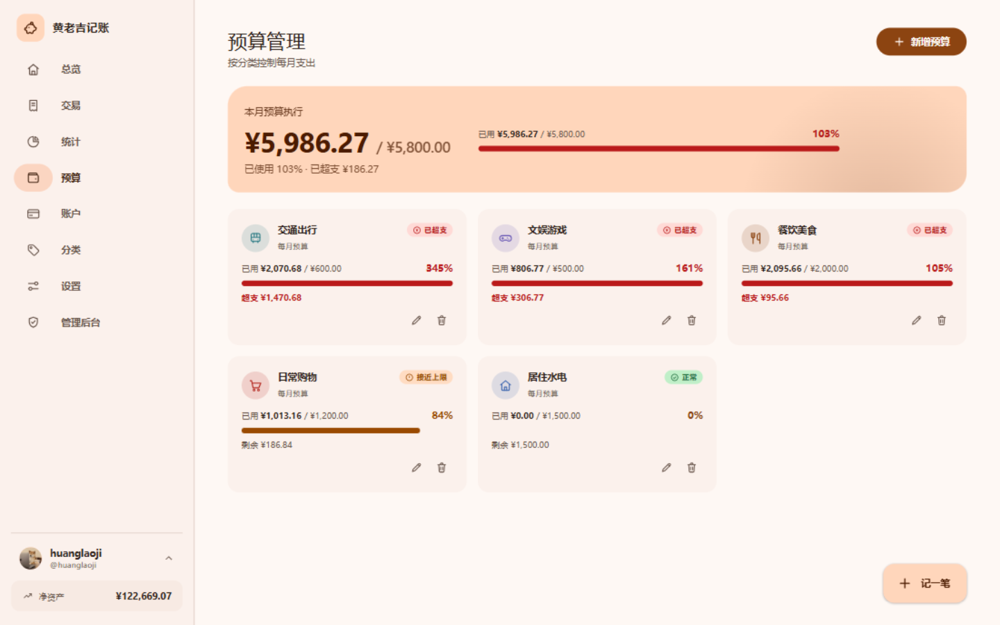

## 6. 账户管理

资金账户卡片（现金 / 银行卡 / 移动支付），余额由期初余额 + 交易流水实时计算，信用卡负债以负数展示；顶部汇总净资产。

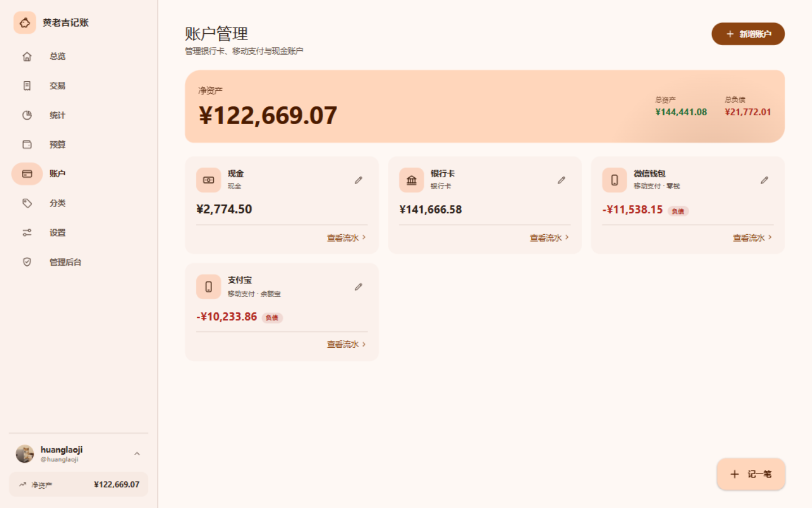

## 7. 分类管理

收支分类的自定义图标与颜色，展示每个分类的本月支出与累计笔数；有交易流水的分类受删除保护。

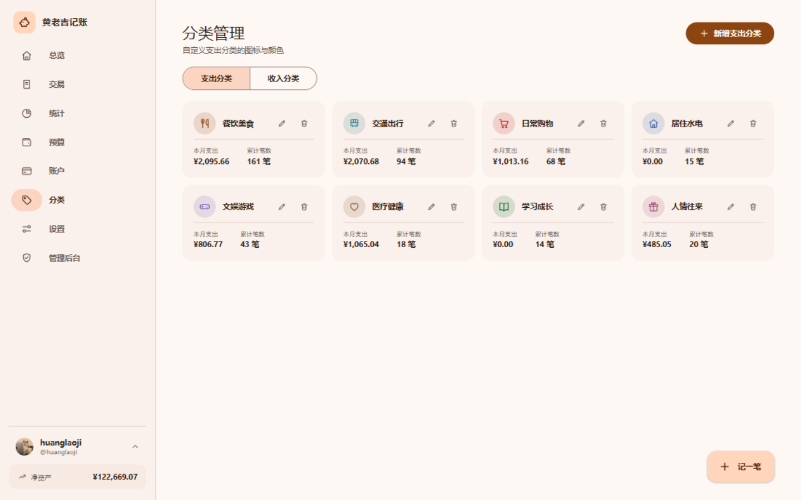

## 8. 设置

主题模式（跟随系统 / 浅色 / 深色）与主题色相滑块（登录后自动同步到云端偏好），数据导出（JSON 备份 / 交易 CSV）。

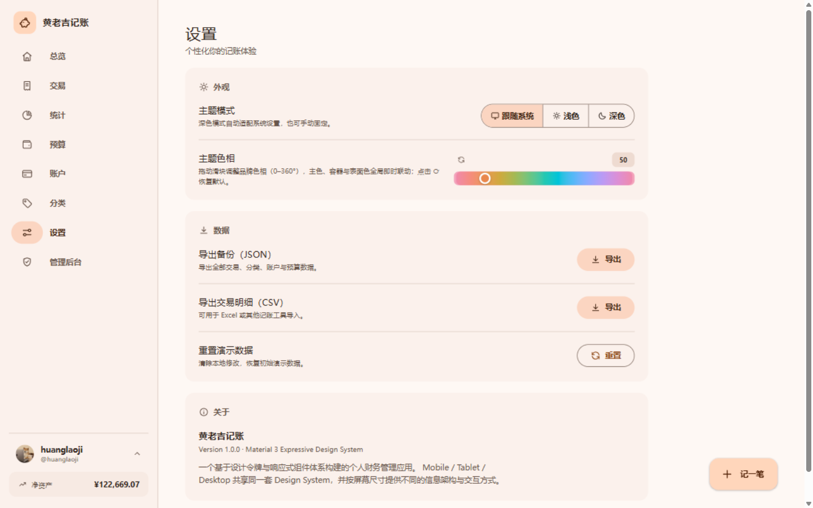

## 9. 个人信息

头像上传（自动居中裁剪压缩）、昵称修改、邮箱 / 手机号绑定与解绑（敏感操作需验证登录密码，至少保留一项联系方式）、修改密码。

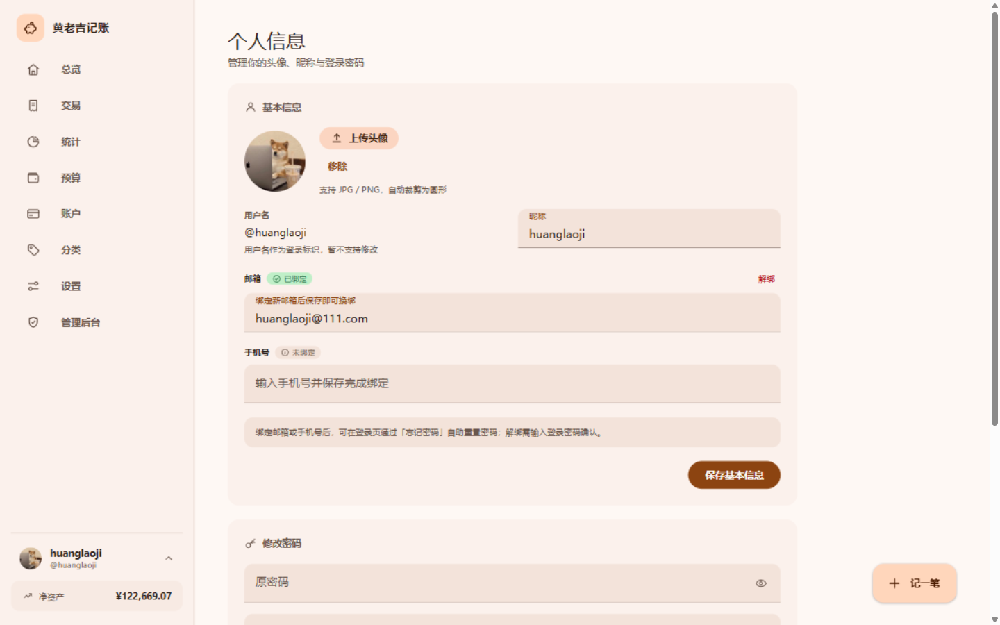

## 10. 管理后台（仅管理员）

全站统计（注册用户 / 管理员数 / 禁用数 / 全局交易数）与用户管理表格：搜索、禁用启用、重置密码、授予 / 收回管理员、删除用户（级联清理其全部数据）。普通用户访问该页会被重定向回首页。

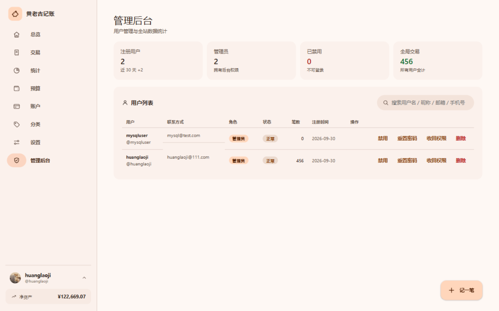

## 11. 移动端（390×844）

响应式布局：底部导航栏 + "更多"抽屉承载次级页面，卡片单列堆叠。

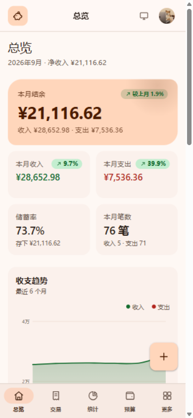
